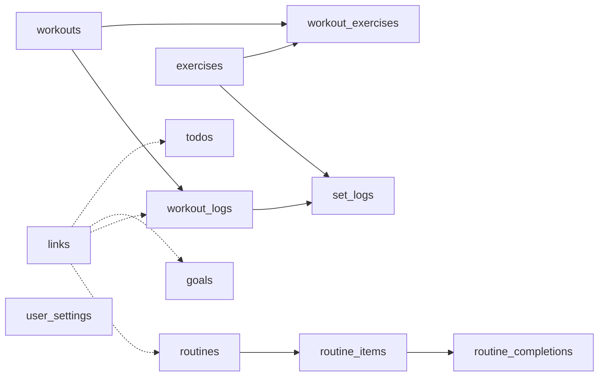

# Life OS – v2 PRD & ERD Baseline

Status: Approved (v2 Phase 1) · Last updated: 2026-09-19

## Overview

v2 fixes the 18 distinct problems found in v1 testing, then adds Goals and Finance on the cleaner base. Stages are ordered so sweeping changes land before more code depends on them, and schema changes land before Goals starts linking everything together.

**Goals**

1. Clear every distinct issue in the [v2 backlog](./v2-backlog.md): 19 items are listed, but two describe the same missing workout-edit feature.
2. Merge Todo into a single Tasks domain.
3. Promote Goals to a full domain, then add Finance, one release each.

**Carried forward from v1**

The vision, user and success metrics stay as in the v1 PRD: a single power user, capture in under 10 seconds, Today dashboard first paint under 1.2 s, zero data loss, near-zero configuration tax. The tech stack and ADR-001 to ADR-007 stand unchanged.

**v2 is done when**

Every backlog item has closed with a regression test (Vitest or Playwright), Goals and Finance have each shipped through the full phase flow, and the Post-Launch Review (Phase 8) is approved.

## Scope

v2 covers five domains across six build phases; the other 14 of the 19 planned domains stay out.

**In scope**

| Stage | Workflow phase | Focus | Schema change | Design work |
| --- | --- | --- | --- | --- |
| 1 | Phase 2 | Quick wins, performance and error tracking | No | Design-system amendment and dark theme |
| 2 | Phase 3 | Rename Todo to Tasks | Yes (rename) | None |
| 3 | Phase 4 | Fitness rework | Yes | Wireframe and mockup for forms |
| 4 | Phase 5 | Routines rework | Yes | Wireframe and mockup |
| 5a | Phase 6 | Goals | Yes | Full phase flow |
| 5b | Phase 7 | Finance | Yes | Full phase flow |

Also in v2: a dark theme and hosted error tracking, both in Stage 1. The theme choice is stored in the browser.

**Out of scope**

- The 14 remaining domains: Projects, Notes, Life Areas, Hobbies, Skills, Health, Mindfulness, Books, Movies, Series, Diet, Recipes, Trips and Inventory. Deferred, not rejected.
- Carried over from v1 unchanged: multi-user or sharing, offline mode, native mobile app, notifications, AI features, and import from Notion or Obsidian. Finance CSV import is separate and is in scope.
- Magic-link login, deferred to a later part of the build.
- Multi-currency Finance. v2 is rupees only.
- Client-side caching, unless Stage 1 measurement demands it. That would need a new ADR superseding parts of ADR-003 and ADR-004.

## Confirmed decisions

Fifteen planning decisions are settled and one implementation detail is left for Stage 5b.

| Decision | Stage |
| --- | --- |
| No fixed performance targets yet: measure the current timings, then improve on them | 1 |
| A dark theme is added in v2 with the Stage 1 design-system amendment; the theme choice is stored in the browser, with no schema change | 1 |
| Hosted error tracking is added in Stage 1 with Sentry, replacing console-only logging; a new ADR records the choice and limits what reports may contain | 1 |
| Todo and Tasks merge into one Tasks domain | 2 |
| Past dates are allowed when creating a task and render as overdue | 2 |
| Workout edits also update past workout logs, and logged sets are never lost (for example when an exercise is removed from a workout) | 3 |
| Workout logs get a stored timestamp; backlog item 12 moves from Stage 1 to Stage 3 | 3 |
| Routine frequency is stored as simple columns (type, times per week, days of week); revisit a recurrence rule format only if needs grow | 4 |
| Each routine item has its own repeatability, set relative to its routine's occurrences (every occurrence, every Nth occurrence, once a week), with no manual per-occurrence skips | 4 |
| An item's next due occurrence counts from the last time it was done, not from a fixed start, so a missed item is due again next time | 4 |
| An item skipped through its repeatability configuration is not counted against completion; an item due today and not completed counts as incomplete | 4 |
| Finance: rupees only; accounts, categories, budgets and recurring items; manual entry plus CSV import; account labels only, never real account numbers | 5b |
| Open: CSV import column mapping and duplicate handling, settled in the Finance data-model pass | 5b |
| Magic-link login is deferred to a later part of the build | Later |
| The existing Data Model artifact stays the single ERD; each stage folds its delta into it | All |
| Documentation approach: a new short v2 PRD, reuse the ERD and ADRs, add deltas | All |

Unchanged from v1: the tech stack (Next.js, Supabase, Vercel, shadcn, Zod, Zustand), ADR-001 to ADR-007, RLS on every table, separate dev and prod Supabase projects, and JSON-only data export.

## Backlog mapping

Eight backlog items land in Stage 1, two in Stage 2, five in Stage 3 and four in Stage 4; Goals and Finance are new work, not backlog. Items are numbered in the backlog's reading order.

| # | Issue | Stage | Schema change |
| --- | --- | --- | --- |
| 1 | Show/hide password icon on login and sign-up | 1 | No |
| 2 | Input boxes are grey and over-rounded | 1 | No |
| 3 | "Add todo" button doesn't match "new workout" and "new routine" | 1 | No |
| 4 | Use shadcn calendar for date pickers | 1 | No |
| 5 | Sidebar should be collapsible | 1 | No |
| 6 | Page switching lags | 1 | No |
| 7 | Todo filter tabs (All, Completed, Active) feel jerky | 1 | No |
| 8 | Past dates when creating a todo (decided: allowed) | 2 | No |
| 9 | Rename "todo" to "tasks" app-wide | 2 | Yes |
| 10 | Exercise-addition form needs a UX pass | 3 | Follows from 11 |
| 11 | Muscle Groups and Equipment become their own submodules | 3 | Yes |
| 12 | Bug: finishing a workout shows "last logged ~15 hours ago" | 3 | Yes (stored timestamp) |
| 13 | Workouts can't be edited once created | 3 | Yes |
| 14 | Exercises are editable but workouts aren't (same gap as 13) | 3 | Merged with 13 |
| 15 | Routines need a time-of-day field | 4 | Yes |
| 16 | Frequency: daily, N times a week, or specific days | 4 | Yes |
| 17 | Routine items skippable or variable per occurrence | 4 | Yes |
| 18 | "View checklist" interaction is not user-friendly | 4 | No |
| 19 | Show export only when the user has data | 1 | No |

## Acceptance criteria by stage

Each stage is accepted when its checks pass on life-os-dev and then on life-os-prod, with changes moving dev to prod as in v1.

**Stage 1: Quick wins and performance**

- Login and sign-up password fields have a show/hide toggle.
- One input style (fill and radius), one set of button variants and the shadcn calendar for every date picker, all defined once in the design system.
- The add-todo button uses the same variant as "New workout" and "New routine".
- The sidebar collapses and expands.
- The export option is hidden when the user has no data.
- A dark palette is added to the design system, and the user can switch between light and dark on every screen; the choice is kept in the browser.
- Sentry captures unhandled server and browser errors in production with stack traces. A new ADR records the choice and limits what reports may contain: no task titles, workout values or financial amounts.
- Page-switch and filter-tab timings are measured before any fix and again after, the cause of each delay is recorded, and each timing improves on that baseline. No fixed targets are set.
- Each fix has a Vitest or Playwright regression test.

**Stage 2: Rename Todo to Tasks**

- No "todo" remains in routes, UI copy, types, Zod schemas, Server Actions, tests or the export shape.
- The migration renames the table and its RLS policies and updates every `links` value that uses the type name `todo`; existing tasks and links are intact.
- It runs on life-os-dev first, then life-os-prod, and stays reversible until prod is confirmed.
- A task can be created with a past due date and shows as overdue.

**Stage 3: Fitness rework**

- Muscle groups and equipment are their own tables with join tables to exercises; existing exercise values are migrated with none lost.
- The exercise form picks from existing muscle groups and equipment, or creates one inline.
- A workout's name can be edited, and its exercises can be added, removed and reordered.
- Workout edits show in past logs, and no workout edit deletes a logged set.
- Workout logs store a timestamp, so a workout just finished shows as just now, not "~15 hours ago" (backlog item 12).
- Before build: data-model delta, then wireframe and mockup for the exercise form and workout edit.

**Stage 4: Routines rework**

- A routine has a time of day.
- Frequency can be daily, N times a week, or specific days of the week.
- Each routine item has its own repeatability, set relative to its routine's occurrences: every occurrence, every Nth occurrence, or once a week. In a daily skincare routine one item can be due daily, another every second day and another weekly; in a weekly bike maintenance routine the wash is due every time and the chain clean and lube every second time. The exact options are settled in the wireframe.
- An item's next due occurrence counts from the last time it was done, not from a fixed start. A missed chain lube is due again at the next maintenance.
- Scheduling comes only from that configuration; there are no manual per-occurrence skips.
- An item not scheduled for a day by its repeatability is not shown as due and is left out of that day's completion percentage.
- An item due today and not completed counts as incomplete in the completion percentage.
- Checking off items takes fewer steps than the current "view checklist" flow; the exact interaction is settled in the wireframe.
- Before build: data-model delta, a recurrence-model ADR, then wireframe and mockup.

**Stage 5a: Goals**

- Scope is defined in Goals' own data-model and PRD pass.
- Starting point: check whether the existing `links` table can carry goal-to-task, goal-to-routine and goal-to-fitness relationships before adding join tables.

**Stage 5b: Finance**

- Accounts (labels only), categories, transactions, budgets and recurring items can be created and edited by manual entry.
- CSV import works, with column mapping and duplicate handling as decided in the Finance data-model pass.
- Amounts are in rupees; the money-representation ADR proposes integer paise, with room to add a currency column later.
- No real account numbers are stored, every new table has RLS, and no financial data goes to a third-party analytics tool.

## ERD baseline

The v2 baseline is the deployed v1 schema: 12 public tables plus Supabase's `auth.users`, with a `user_id` on every table for RLS. Checked against the live table listing of life-os-dev (columns, foreign keys, RLS flags), it matches the v1 data model. That doc says 13 tables but lists 12; 12 is correct. Migration history and life-os-prod were not checked.

Solid arrows are foreign keys from parent to child; dotted arrows are the `links` table's polymorphic references, which have no foreign key.

**Expected change per table**

Each stage writes a short data-model delta first, then folds it into the existing Data Model artifact, the single ERD, when it ships. Rows below are expectations, not designs.

| Table | Stage | Expected change |
| --- | --- | --- |
| `todos` | 2 | Renamed to `tasks` with its RLS policies; `links` check constraints and existing `todo` values updated |
| `links` | 2, 5a | Type check allows only todo, workout_log, goal and routine; life-os-dev has no link rows yet. Stage 5a tests whether it can carry Goals relationships |
| `routines` | 4 | Add time of day and frequency columns (type, times per week, days of week); today only daily or weekly is allowed |
| `routine_items` | 4 | Per-item repeatability configuration relative to the routine's occurrences, replacing the plan's required or optional flag |
| `routine_completions` | 4 | Today one row per item per period start, and its presence means checked. An item's next due occurrence counts from its last completion (decided), which the Stage 4 delta must make derivable |
| `exercises` | 3 | `muscle_groups` and `equipment` are text arrays today; they move to their own tables with join tables |
| `workouts`, `workout_exercises` | 3 | Become editable; the delta must protect logged sets |
| `workout_logs` | 3 | Add a stored timestamp (backlog item 12); `performed_on` is only a date today |
| `set_logs` | 3 | References its exercise and session directly, not the workout template; delta confirms delete rules |
| `goals` | 5a | Minimal today (title, target date, status); full fields set in its own pass |
| `user_settings` | none | No change expected |
| New Finance tables | 5b | Accounts, categories, transactions, budgets and recurring items, designed in the Finance data-model pass |

## Open questions

No open questions remain for Phase 1.
